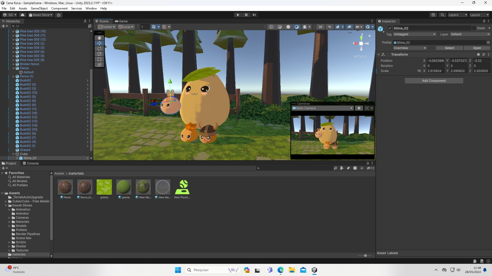

<h1>Susana e Sabrina</h1>

<h2>Aplicação da física no Unity</h2>

 
<h3>Nossa ideia principal:</h3>
<h5>Antes de qualquer coisa, pensamos em uma inspiração. Ambas gostamos muito do Totoro, um personagem do anime "Meu amigo Totoro", então decidimos usá-lo como inspiração.</h5>

