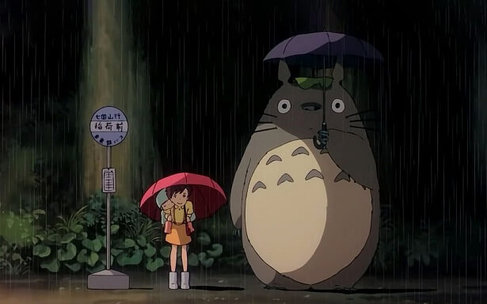
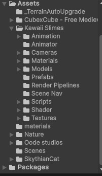
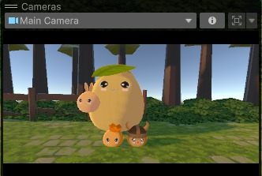
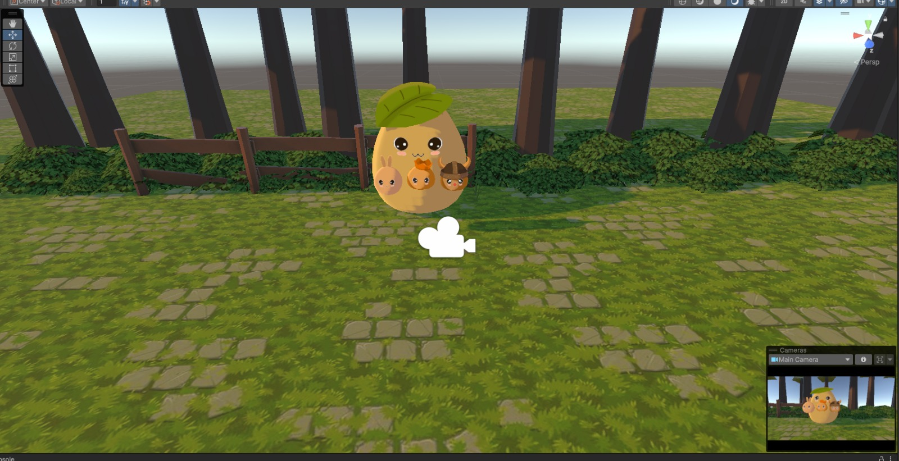
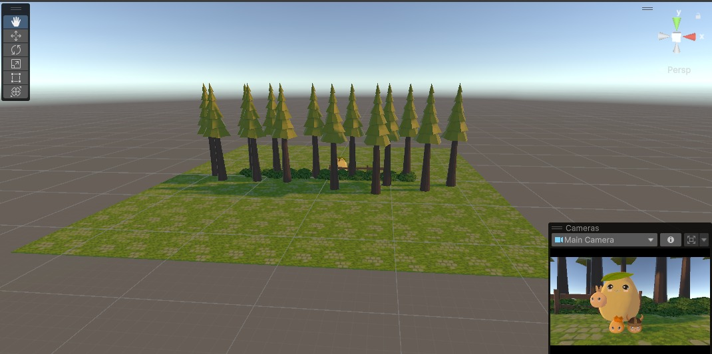
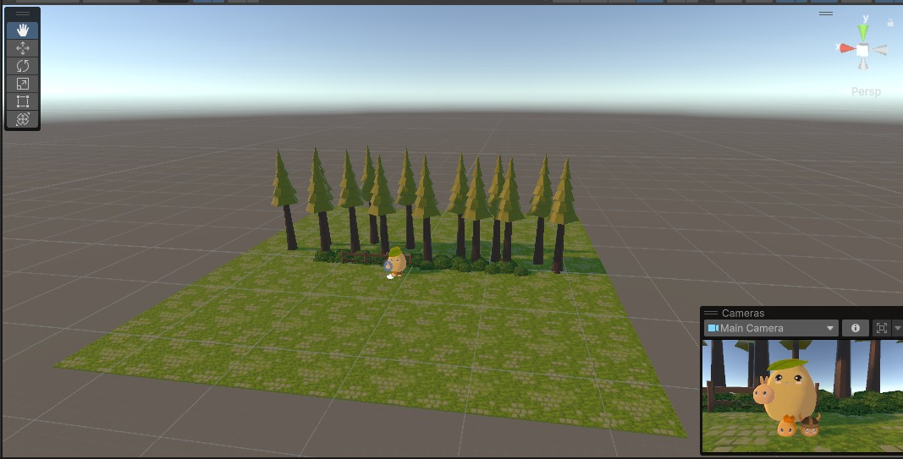

<h1>Susana e Sabrina</h1>

<h2>Aplicação da física no Unity</h2>

 
<h3>Nossa ideia principal:</h3>
<h5>Antes de qualquer coisa, pensamos em uma inspiração. Ambas gostamos muito do Totoro, um personagem do anime "Meu amigo Totoro", então decidimos usá-lo como inspiração.</h5>

 
<h3>Colocando os elementos da nossa cena:</h3>
<h5>Para colocarmos nossos personagens e outros elementos em nossa cena, fomos na Asset store, onde têm vários elementos que podemos colocar em nossa cena do unity. Muitos dos elementos lá disponíveis são pagos, então optamos por filtrar por elementos gratuitos. Para adicionar uma das modelagens escolhidas, vamos precisar clicar na opção "obter arquivo" e abrir o Unity. Após isso, vamos precisar clicar em "import" nessa nova janela e em "download" para confirmar o download dos elementos.</h5>
<h5>Para encontrarmos a pasta que foi baixada, iremos no canto inferior esquerdo e abriremos a pasta "assets", lá estará a pasta baixada.</h5>

 
<h5>Para o chão do nosso projeto,criamos um material nosso,para isso seguimos os seguintes passos:</h5>
<h5> 1- Procuramos a imagem no google</h5>
<h5> 2- No unity, criamos um novo material</h5>
<h5> 3- Ao baixarmos a imagem, iremos adicionar ao "albedo" desse material criado</h5>
<h5> 4- E então, mexemos em seu Tiling para que a repetição ficasse natural e adaptamos seu tom</h5>

 

<h5>Quando fomos adicionar nossos persongans e outros elementos, fomos em "prefabs" que estará dentro da pasta que foi baixada da asset store; para adicionar um dos elementos na cena apenas arrastamos ele para nossa cena em si, porém, a textura não estava funcionando. Caso isso aconteça com você também, basta criar um material com a textura do próprio elemento (normalmente a textura tem o nome do elemento, basta pesquisar na aba de pesquisa do "albedo").</h5>

<h5>Com relação à luz, alteramos sua cor para que se parecesse um fim de tarde e sua posição para dar o efeito de sombra que desejávamos.</h5>

 
<h5>Uma das partes mais importantes da nossa cena é a posição da câmera. Alteramos ela para que ela ficasse mais próxima e mais alta com relação aos personagens (a posição dela pode ser alterada da mesma formaque alteramos a posição de outros elementos).</h5>

 
<h5> Quando fomos montar o restante de nosso cenário que no caso é uma floresta, decidimos posionar as árvores usadas de forma que desse mais volume e parecesse mais natural sem que tivessemos que adicionar mais de 50 elementos. Para isso, alternamos suas posições sempre olhando qual seria a visão final da nossa cena.</h5>

 
<h3>Parte física do nosso projeto:</h3>

<h5> Enfrentamos alguns problemas com a fisica dos assets que vieram da asset store. Um dos problemas foi que os elementos que colocamos na cena ao adicionarmos a física que queríamos (nesse caso bounce), eles estavam atravessando o "piso", então tivemos que mudar o plano para um cubo com proporções mais finas para simular um "chão"/plane. Ainda assim, os personagens ultrapassavam o chão. fizemos um teste e chegamos a conclusão de que o problema estava nos elementos que pegamos na asset store. Para resolver esse problema, tivemos que criar uma esfera transparente com o mesmo efeito da física que nosso elemento e a colocamos dentro do nosso personagem que queríamos que pulasse. Para que o personagem caísse, antes de adicionarmos o efeito de "bounceness", tivemos que adicionar a física rigidBody. </h5>

<h6>(Visão e imagem final da adição dos elementos da nossa cena)</h6>

 
<h3> Vídeo:</h3>
<h5> Nosso projeto ultrapassava o limite de tamanho do arquivo do Github, então o anexamos com um link do drive.</h5>

<h5> https://drive.google.com/file/d/1kZGRK37KmL55szY57xzgX2afFSjRJG-h/view?usp=sharing </h5>
